\[test\]“(C:/Users/Richard/Documents/Data
Science/GDAT515/JStanfield—Assignment-1/images/BadViz.PNG”)

``` r
#install.packages("gapminder")

library(gapminder)
```

    ## Warning: package 'gapminder' was built under R version 3.6.2

``` r
library(tidyverse)
```

    ## -- Attaching packages ---------------------------------------------------- tidyverse 1.2.1 --

    ## v ggplot2 3.2.0     v purrr   0.3.2
    ## v tibble  2.1.3     v dplyr   0.8.3
    ## v tidyr   1.0.0     v stringr 1.4.0
    ## v readr   1.3.1     v forcats 0.4.0

    ## -- Conflicts ------------------------------------------------------- tidyverse_conflicts() --
    ## x dplyr::filter() masks stats::filter()
    ## x dplyr::lag()    masks stats::lag()

``` r
#install.packages("ggthemes")
library(ggthemes)
```

    ## Warning: package 'ggthemes' was built under R version 3.6.2

``` r
#install.packages("wesanderson")
library(wesanderson)
```

    ## Warning: package 'wesanderson' was built under R version 3.6.2

``` r
data("gapminder")

str(gapminder)
```

    ## Classes 'tbl_df', 'tbl' and 'data.frame':    1704 obs. of  6 variables:
    ##  $ country  : Factor w/ 142 levels "Afghanistan",..: 1 1 1 1 1 1 1 1 1 1 ...
    ##  $ continent: Factor w/ 5 levels "Africa","Americas",..: 3 3 3 3 3 3 3 3 3 3 ...
    ##  $ year     : int  1952 1957 1962 1967 1972 1977 1982 1987 1992 1997 ...
    ##  $ lifeExp  : num  28.8 30.3 32 34 36.1 ...
    ##  $ pop      : int  8425333 9240934 10267083 11537966 13079460 14880372 12881816 13867957 16317921 22227415 ...
    ##  $ gdpPercap: num  779 821 853 836 740 ...

``` r
ggplot()
```

<!-- -->

``` r
ggplot(data = gapminder, mapping = aes(x = year, y = pop, color = continent)) +
  geom_point()
```

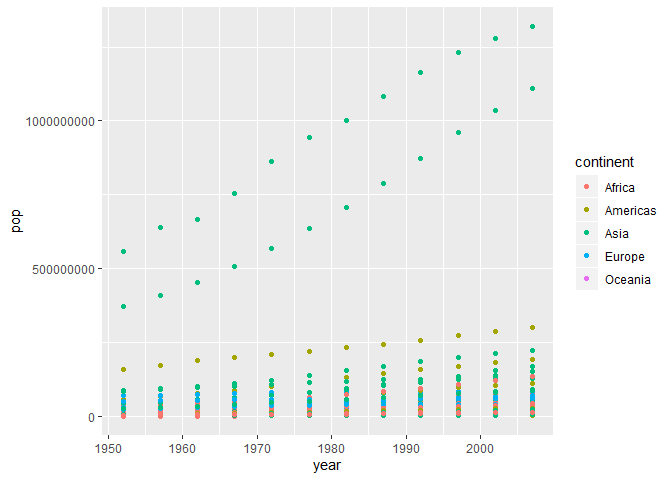<!-- -->

``` r
#aggregate by continent

gapminder %>%
  group_by(year, continent) %>%
  summarise(pop = sum(pop)) %>%
ggplot(data = ., mapping = aes(x = year, y = pop, color = continent)) +
  geom_point()
```

    ## Warning in summarise_impl(.data, dots, environment(), caller_env()):
    ## integer overflow - use sum(as.numeric(.))
    
    ## Warning in summarise_impl(.data, dots, environment(), caller_env()):
    ## integer overflow - use sum(as.numeric(.))
    
    ## Warning in summarise_impl(.data, dots, environment(), caller_env()):
    ## integer overflow - use sum(as.numeric(.))
    
    ## Warning in summarise_impl(.data, dots, environment(), caller_env()):
    ## integer overflow - use sum(as.numeric(.))
    
    ## Warning in summarise_impl(.data, dots, environment(), caller_env()):
    ## integer overflow - use sum(as.numeric(.))
    
    ## Warning in summarise_impl(.data, dots, environment(), caller_env()):
    ## integer overflow - use sum(as.numeric(.))
    
    ## Warning in summarise_impl(.data, dots, environment(), caller_env()):
    ## integer overflow - use sum(as.numeric(.))
    
    ## Warning in summarise_impl(.data, dots, environment(), caller_env()):
    ## integer overflow - use sum(as.numeric(.))

    ## Warning: Removed 8 rows containing missing values (geom_point).

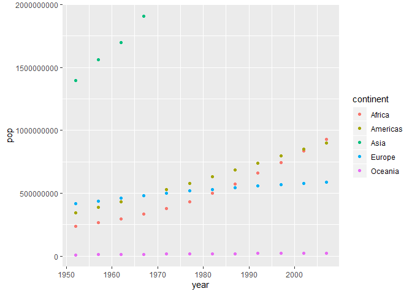<!-- -->

``` r
gapminder %>%
  group_by(year, continent) %>%
  summarise(pop = sum(pop)) %>%
ggplot(data = ., mapping = aes(x = year, y = pop, color = continent)) +
  geom_point() +
  scale_y_log10()
```

    ## Warning in summarise_impl(.data, dots, environment(), caller_env()):
    ## integer overflow - use sum(as.numeric(.))
    
    ## Warning in summarise_impl(.data, dots, environment(), caller_env()):
    ## integer overflow - use sum(as.numeric(.))
    
    ## Warning in summarise_impl(.data, dots, environment(), caller_env()):
    ## integer overflow - use sum(as.numeric(.))
    
    ## Warning in summarise_impl(.data, dots, environment(), caller_env()):
    ## integer overflow - use sum(as.numeric(.))
    
    ## Warning in summarise_impl(.data, dots, environment(), caller_env()):
    ## integer overflow - use sum(as.numeric(.))
    
    ## Warning in summarise_impl(.data, dots, environment(), caller_env()):
    ## integer overflow - use sum(as.numeric(.))
    
    ## Warning in summarise_impl(.data, dots, environment(), caller_env()):
    ## integer overflow - use sum(as.numeric(.))
    
    ## Warning in summarise_impl(.data, dots, environment(), caller_env()):
    ## integer overflow - use sum(as.numeric(.))

    ## Warning: Removed 8 rows containing missing values (geom_point).

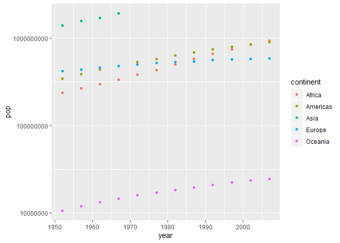<!-- -->

``` r
ggplot(data = gapminder, mapping = aes(x = year, y = gdpPercap)) +
  geom_point()
```

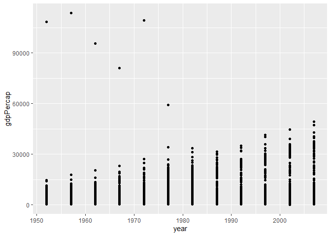<!-- -->

``` r
gapminder %>%
  filter(continent == "Asia") %>%
ggplot(data = ., mapping = aes(x = year, y = gdpPercap, color = country)) +
  geom_point() +
  facet_wrap(~continent)
```

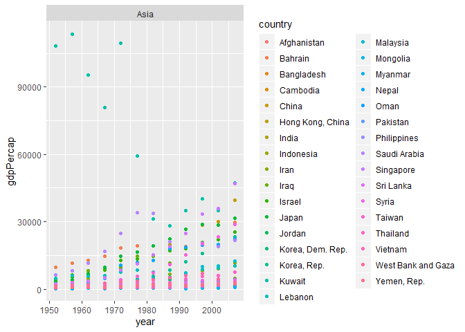<!-- -->

try two numeric measures

``` r
ggplot(data = gapminder, aes(x = gdpPercap, y = lifeExp)) +
  geom_point()
```

<!-- -->

``` r
ggplot(data = gapminder, aes(x = gdpPercap, y = lifeExp, color = continent)) +
  geom_point() +
  scale_x_log10()
```

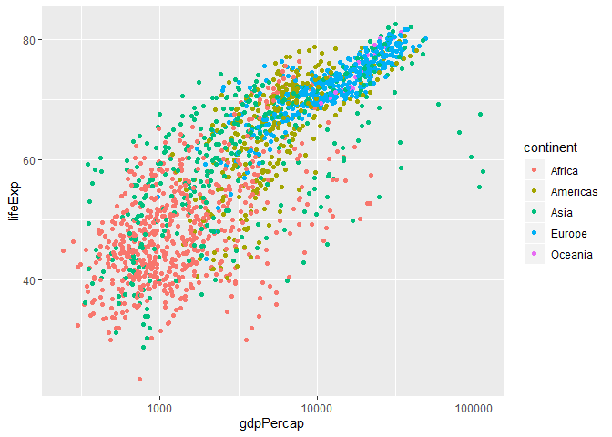<!-- -->

``` r
ggplot(data = gapminder, aes(x = gdpPercap, y = lifeExp, color = continent)) +
  geom_point() +
  scale_x_log10() +
  stat_smooth(method = "lm") #can just leave blank for default
```

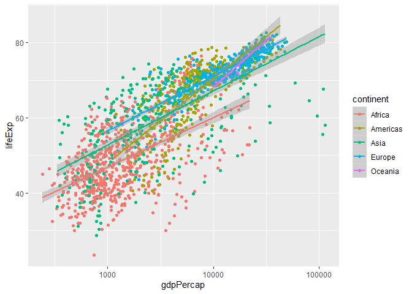<!-- -->

``` r
ggplot(data = gapminder, aes(x = gdpPercap, y = lifeExp, color = continent, size = pop)) +
  geom_point() +
  scale_x_log10() +
  stat_smooth(method = "lm") #can just leave blank for default
```

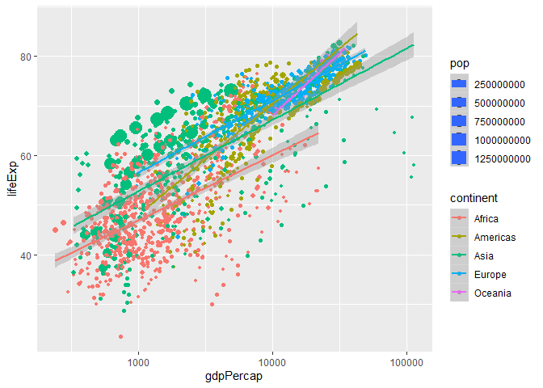<!-- -->

``` r
#this is useless
gapminder %>%
filter(continent == "Europe") %>%
  group_by(country) %>%
  summarise(gdpPercap = mean(gdpPercap),
            lifeExp = mean(lifeExp)) %>%
ggplot(data = ., mapping = aes(x = gdpPercap, y = lifeExp, shape = country)) +
  geom_point() +
  scale_x_log10() +
  stat_smooth(method = "lm") #can just leave blank for default
```

    ## Warning: The shape palette can deal with a maximum of 6 discrete values
    ## because more than 6 becomes difficult to discriminate; you have
    ## 30. Consider specifying shapes manually if you must have them.

    ## Warning: Removed 24 rows containing missing values (geom_point).

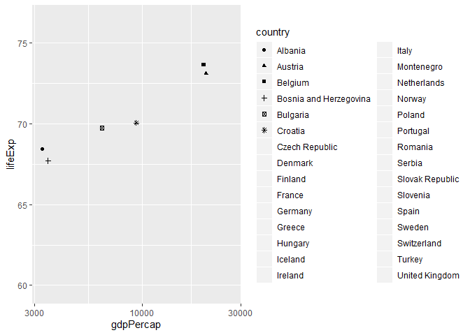<!-- -->

``` r
ggplot(data = gapminder, mapping = aes(x = gdpPercap, y = lifeExp, linetype = continent)) +
  scale_x_log10() +
  stat_smooth(method = "lm") #can just leave blank for default
```

<!-- -->

``` r
ggplot(data = gapminder, mapping = aes(x = gdpPercap, y = lifeExp)) +
  geom_point(aes(color = continent, alpha = pop)) + 
  scale_x_log10() +
  stat_smooth(method = "lm") #can just leave blank for default
```

<!-- -->

``` r
ggplot(data = gapminder, mapping = aes(x = gdpPercap, y = lifeExp)) +
  geom_point(aes(color = continent), alpha = .4) + 
  scale_x_log10() +
  stat_smooth(method = "lm", mapping = aes(color = continent)) #can just leave blank for default
```

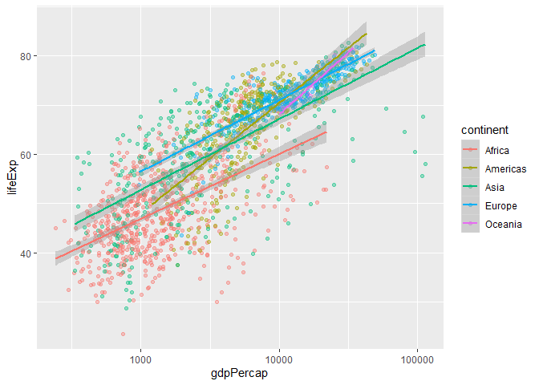<!-- -->

``` r
ggplot(data = gapminder, mapping = aes(x = gdpPercap, y = lifeExp)) +
  geom_point(, alpha = .4) + 
  scale_x_log10() +
  stat_smooth(method = "lm") +  #can just leave blank for default
  facet_wrap(~continent) +
  xlab("GDP per Capita") +
  ylab("Life Expectancy") +
  ggtitle("Life Expectancy By Per Capita GDP", subtitle = "Faceted by Continent")
```

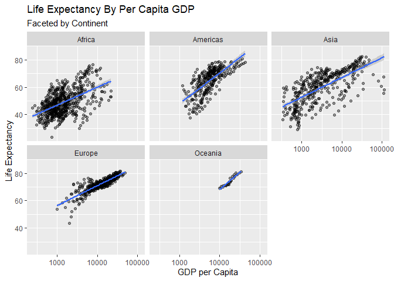<!-- -->

``` r
ggplot(data = gapminder, mapping = aes(x = gdpPercap, y = lifeExp)) +
  geom_point(, alpha = .4) + 
  scale_x_log10() +
  stat_smooth(method = "lm") +  #can just leave blank for default
  facet_wrap(~continent) +
  xlab("GDP per Capita") +
  ylab("Life Expectancy") +
  ggtitle("Life Expectancy By Per Capita GDP", subtitle = "Faceted by Continent") + 
  coord_flip()
```

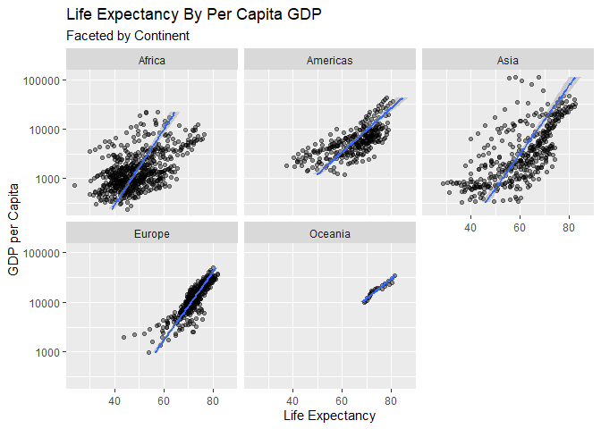<!-- -->

``` r
ggplot(data = gapminder, mapping = aes(x = continent, y = lifeExp)) +
  geom_boxplot() + 
  coord_flip()
```

<!-- -->

``` r
ggplot(data = gapminder, mapping = aes(x = continent, y = lifeExp)) +
  stat_summary(fun.ymin = min, 
               fun.ymax = max,
               fun.y = median) +
  geom_boxplot() + 
  coord_flip() +
  theme_wsj()  #many theme options
```

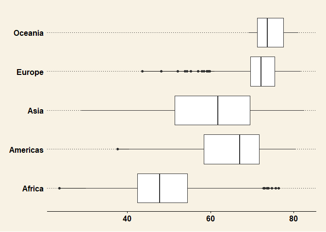<!-- -->
